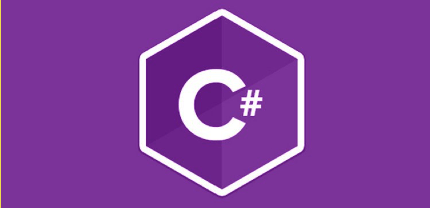

# Curso-de-CSharp

### Puedes usar este repositorio y consultar las referencias de las anotaciones para que se te facilite la búsqueda autodidacta en el estudio del lenguaje C#

 

# Referencias 

------------------------------------------------------------------------
### Tutoriales 
https://www.javatpoint.com/c-sharp-tutorial

https://www.youtube.com/playlist?list=PLU8oAlHdN5BmpIQGDSHo5e1r4ZYWQ8m4B

https://www.w3schools.com/cs/index.php

https://www.tutorialsteacher.com/csharp

https://www.alphacodingskills.com/index.php

------------------------------------------------------------------------

------------------------------------------------------------------------------------------------
### Microsoft 

https://docs.microsoft.com/en-us/dotnet/csharp/

https://docs.microsoft.com/en-us/dotnet/csharp/

https://docs.microsoft.com/es-es/dotnet/csharp/language-reference/

https://docs.microsoft.com/es-es/dotnet/csharp/language-reference/language-specification/readme

------------------------------------------------------------------------------------------------

-----------------------------------------------------------------------------
### Vídeo Tutorioal de referencia 

https://www.youtube.com/playlist?list=PLU8oAlHdN5BmpIQGDSHo5e1r4ZYWQ8m4B

-----------------------------------------------------------------------------
